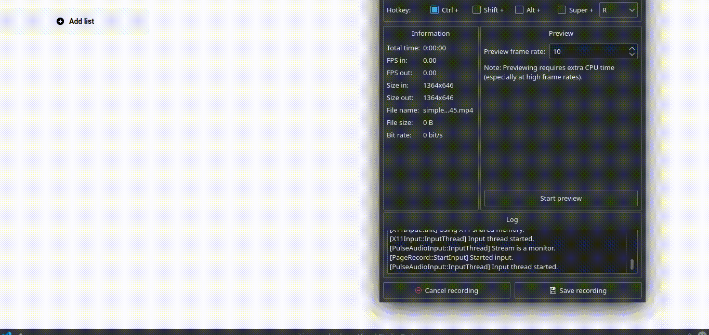

# Kanban Board



## Libraries Used
 - React.js
 - [Zustand](https://github.com/pmndrs/zustand) for global state management.
 - [TailwindCSS](https://tailwindcss.com/) for styling.
 - [react-beatuful-dnd](https://www.npmjs.com/package/react-beautiful-dnd) for drag and drop.

## Live Project

Live project link can be found [here](https://nebula-ee09d.web.app/).

## Setup

To setup the project on your local machine, clone the repository and run the following commands.

```shell
$ yarn install
```

The above command will install all the dependencies.

```shell
$ yarn start
```

The above command will launch a local copy of the project on `http://localhost:3000/`

## How The Project Works

The project is a simple kanban board application built using React and other libraries mentioned above. I've used localStorage to persist the data across browser refreshes.

`react-beautiful-dnd` does most of the heavy lifting when it comes to drag and drop. I've used `zustand` instead of `redux` to maintain my global state as it provides an easier way to manage your global state without all the boilerplate.

I've used `tailwindcss` to provide styling for the application.